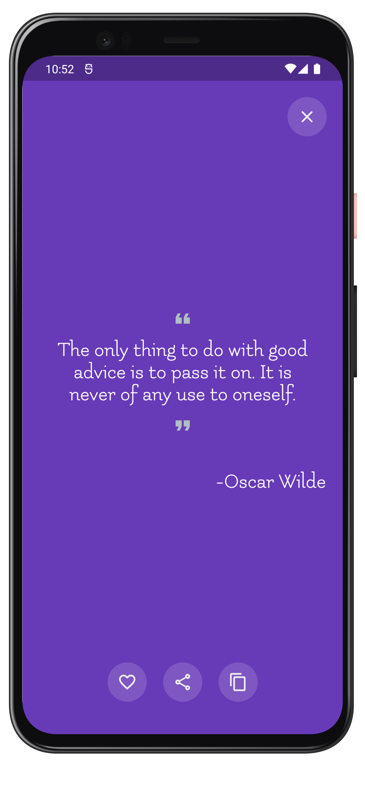
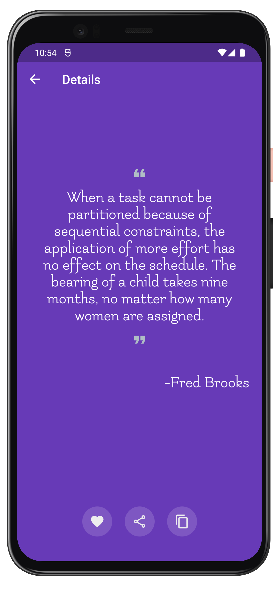
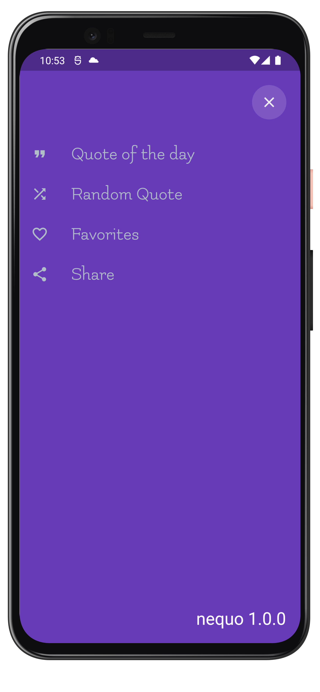
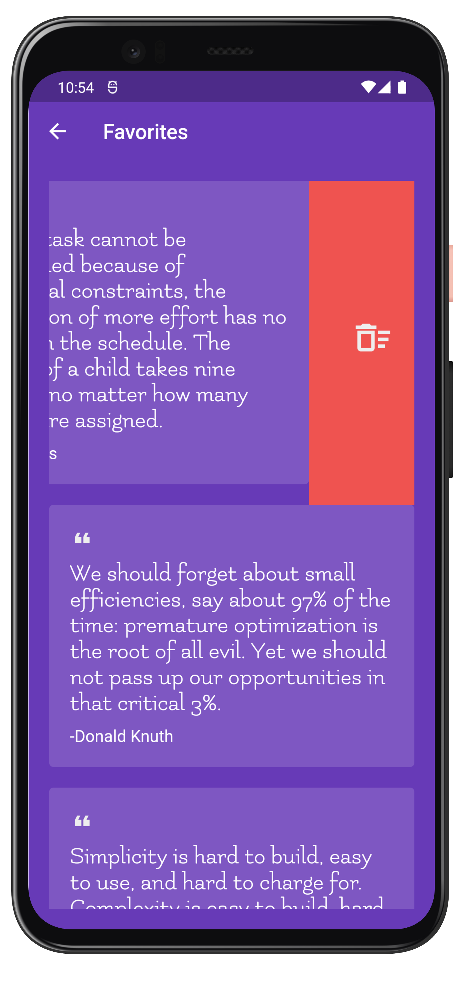

<h1 align="center"> Nequo </h1>

<p align="center">
  <a href="https://github.com/ErickLuizA/nequo/graphs/commit-activity" alt="Maintenance">
    
  </a>

  <a href="./LICENSE" alt="License: MIT">
    
  </a>

<br/>


<a href="https://github.com/ErickLuizA/nequo/stargazers">
  
</a>

<p align="center">
  <a href="#clipboard-description">Description</a>&nbsp;&nbsp;&nbsp;|&nbsp;&nbsp;&nbsp;
  <a href="#building_construction-technologies">Technologies</a>&nbsp;&nbsp;&nbsp;|&nbsp;&nbsp;&nbsp;
  <a href="#rocket-getting-started">Getting Started</a>&nbsp;&nbsp;&nbsp;|&nbsp;&nbsp;&nbsp;
  <a href="#memo-license">License</a>&nbsp;&nbsp;&nbsp;|&nbsp;&nbsp;&nbsp;
  <a href="#framed_picture-screenshots">Screenshots</a>
</p>

## :clipboard: Description

Nequo is a quote app built with flutter.

<a href="https://play.google.com/store/apps/details?id=com.deverick.nequo">
  
</a>


## :building_construction: Technologies

- [Flutter](https://flutter.dev/)
  - [http](https://pub.dev/packages/http)
  - [sqflite](https://pub.dev/packages/sqflite)
  - [path](https://pub.dev/packages/path)
  - [share](https://pub.dev/packages/share)
  - [google_fonts](https://pub.dev/packages/google_fonts)
  - [http](https://pub.dev/packages/http)
  - [data_connection_checker](https://pub.dev/packages/data_connection_checker)
  - [shared_preferences](https://pub.dev/packages/shared_preferences)
  - [get_it](https://pub.dev/packages/get_it)
  - [flutter_bloc](https://pub.dev/packages/flutter_bloc)
  - [bloc](https://pub.dev/packages/bloc)
  - [dartz](https://pub.dev/packages/dartz)
  - [equatable](https://pub.dev/packages/equatable)
  - [mockito](https://pub.dev/packages/mockito)


## :rocket: Getting Started

## 1. Download the repository

```shell
 $ git clone https://github.com/ErickLuizA/nequo.git
  
  or 

 $ gh repo clone ErickLuizA/nequo
```

## 2. Installation

```shell
# Go into the repository
$ cd nequo

# Install dependencies
$ flutter pub get 

# or just use your IDE
```

## 3. Execution

```shell
$ flutter run

# or just use your IDE
```


## :framed_picture: Screenshots

<div>
  
  
  
  
  
</div>
## :memo: License


This project is under the MIT license. See the file [LICENSE](LICENSE) for more details.

---

Build with 💙 By [Erick](https://www.linkedin.com/in/erick-luiz-47151a1a4/)
